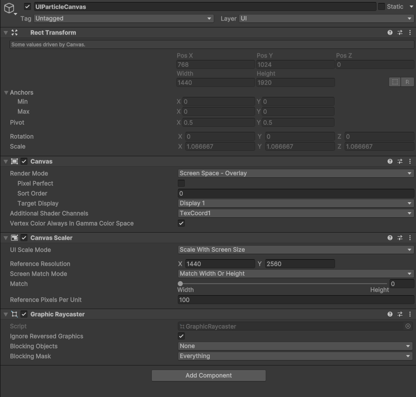
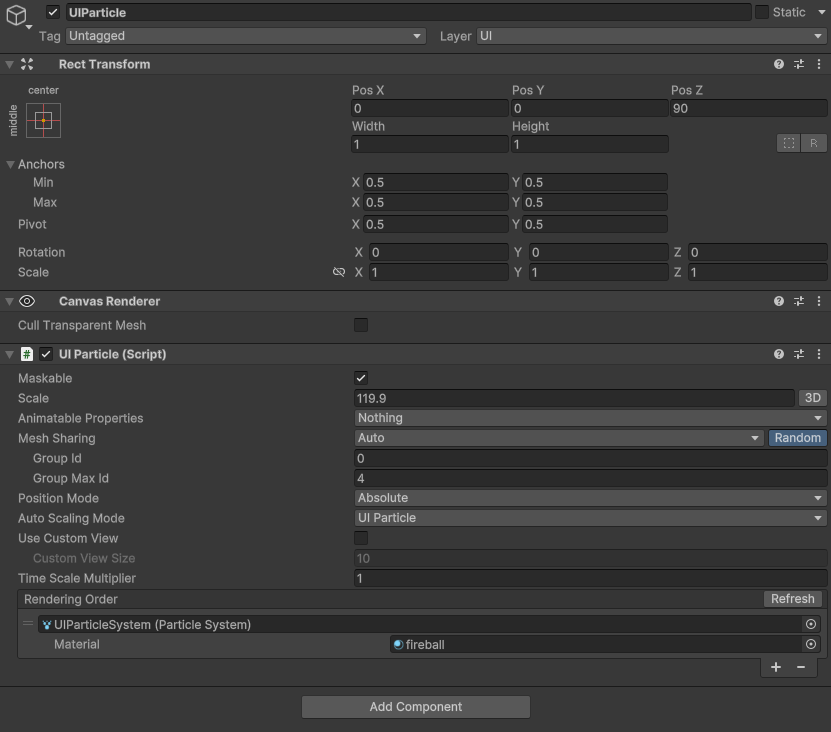
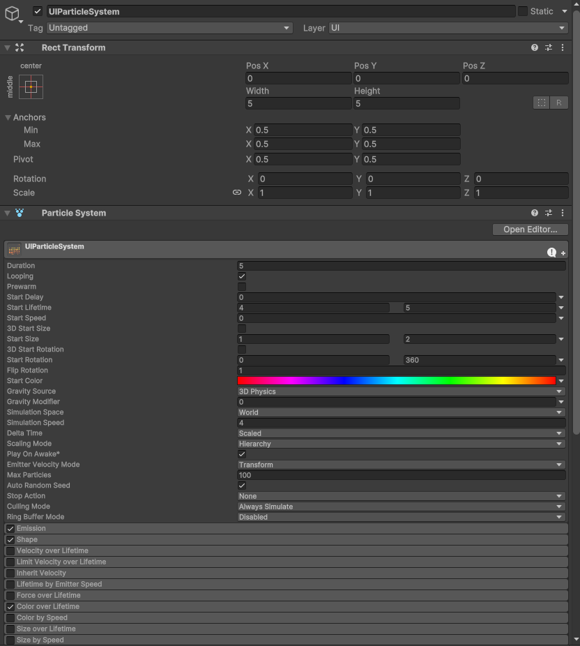
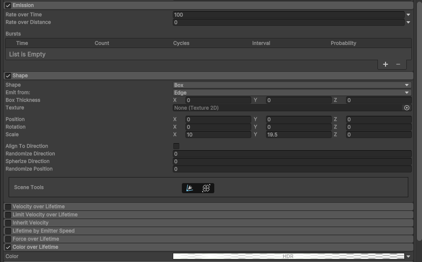
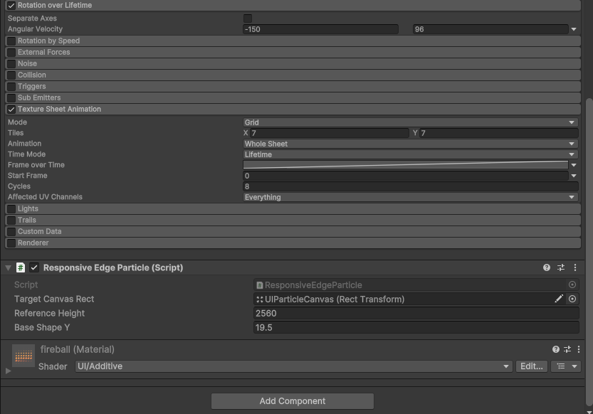
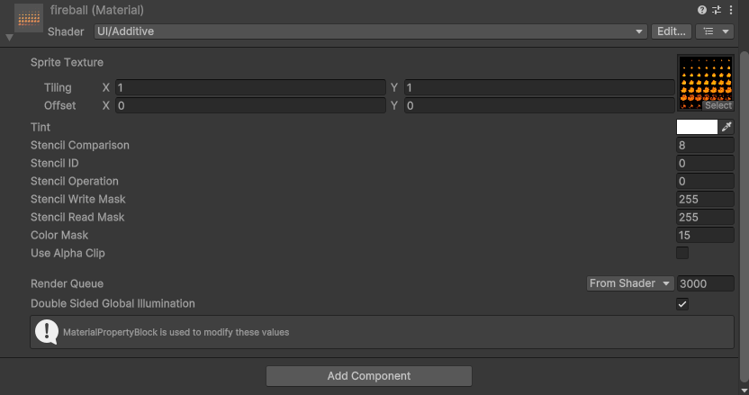

# ResponsiveUIParticleSystem
```
using UnityEngine;

[RequireComponent(typeof(ParticleSystem))]
public class ResponsiveEdgeParticle : MonoBehaviour
{
    public RectTransform targetCanvasRect; // 조절 기준이 되는 캔버스 RectTransform
    public float referenceHeight = 2560f; // 기준 해상도 높이 (예: 1080p)
    public float baseShapeY = 19.5f; // 기준 해상도에서의 shape Y 값

    private ParticleSystem particleSystem;

    void Start()
    {
        particleSystem = GetComponent<ParticleSystem>();
        UpdateShapeScale();
    }

    void UpdateShapeScale()
    {
        if (targetCanvasRect == null) return;

        float currentHeight = targetCanvasRect.rect.height;
        float scaleFactor = currentHeight / referenceHeight;

        var shape = particleSystem.shape;
        Vector3 currentScale = shape.scale;
        currentScale.y = baseShapeY * scaleFactor;
        shape.scale = currentScale;
    }

#if UNITY_EDITOR
    void OnValidate()
    {
        if (Application.isPlaying && particleSystem != null)
        {
            UpdateShapeScale();
        }
    }
#endif
}
```
  
  
  
  
  
  
  